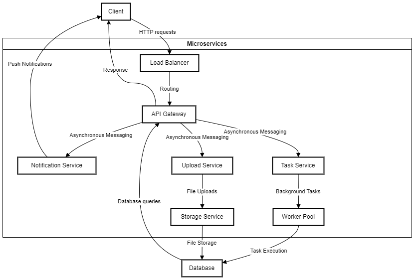
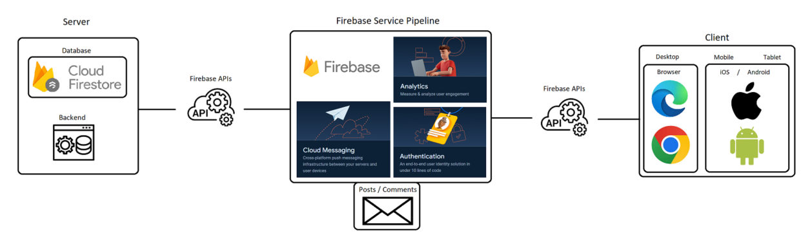
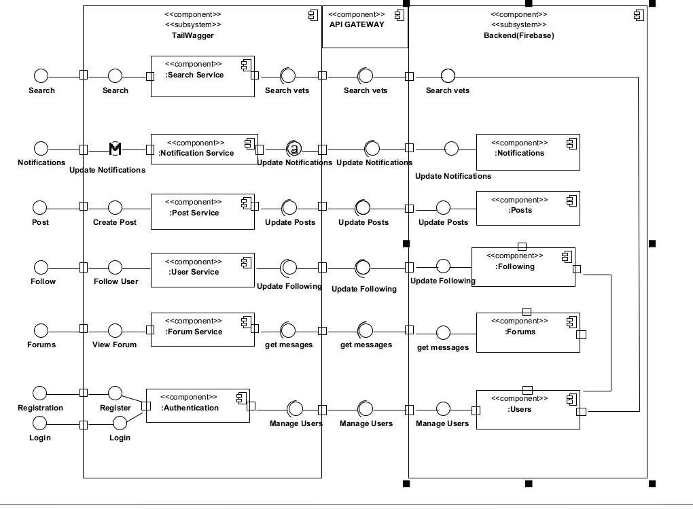
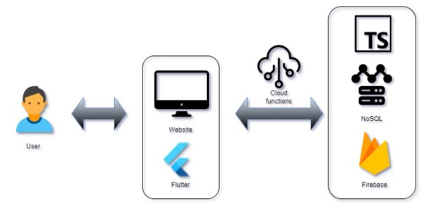

# Architectural requirements
## Architectural design strategy
We have opted to design based on our quality requirements. This strategy will ensure that the project upholds our quality requirements throughout its development and, by extent, always meets the needs of the client, naturally leading to their satisfaction. This also ensures that the client’s needs are always prioritised, rather than developing according to what’s easiest for the system or the like

## Architectural strategies
### Asynchronous Messaging

The use of asynchronous messaging will allow the system to handle notifications, post uploads, and other tasks without blocking the main application or forcing the user to reload the page to view live updates. This will improve system responsiveness and user experience, as well as decouple components, making the system more scalable and maintainable.
#### Usage
- **Notifications (get/send):** Asynchronous messaging is perfect for handling notifications. When a user performs an action that triggers a notification (e.g., a new comment on a post, a like on a post, etc.), an event can be placed on a message queue. This allows the main application to continue processing other requests without waiting for the notification to be sent.
- **Chat discussion:** Asynchronous messaging will allow the user to send and receive messages on a forumn they are invlolved in without having to reload the page to view new outgoing and new incoming messages. This will allow for a more seamless user experience.
#### Benefits
- Improves system responsiveness and user experience.
- Decouples components, making the system more scalable and maintainable.
- Handles high loads effectively.

### Client-Server

The Client-Server architectural pattern is a fundamental design pattern for networked applications. It separates the client (front-end) from the server (back-end), allowing each to be developed and used independently. The client is responsible for the presentation layer (What the user sees), while the server (API and database) handles the business logic and data access layer. This separation of concerns makes the system more modular and easier to maintain.
#### Usage
- **Viewing and Uploading Posts:** The client-server model is fundamental for retrieving and displaying posts. The client (web browser or mobile app) makes requests to the server, which processes the request, fetches data from the database, and sends the posts back to the client.
When a user uploads a post, the client sends the post data to the server, which then stores the post in the database to be viewed by other users.
- **Locating Vets and Pet Sitters:** The client sends a request with location data to the server, which then queries the database to fetch nearby vets and pet sitters. The server sends the results back to the client for display.
- **Search Users:** The client sends a request to the server with the search query which contains the name of a user the person wishes to find, and the server queries the database for users matching the search query. The server then sends the results back to the client for display.
- **Forums:** The client displays a list of forums which the user may select, the client then sends a request to the database to retrieve the posts in the forum. The server then sends the posts back to the client for display.
- **Profile Page:** The client sends a request to the server to retrieve the user's profile information, the server then queries the database for the user's profile information and sends it back to the client for display.
##### Benefits
- Separates concerns between the client (presentation layer) and the server (business logic and data access layer).
- Facilitates easier updates and maintenance, as changes to the server or client can be made independently.
- Enhances security by centralizing sensitive operations on the server.

### Component-Based

The Component-Based architectural pattern divides the system into smaller, reusable components that can be developed, tested, and maintained independently. This pattern promotes reusability, simplifies testing and debugging, and enhances scalability.
#### Usage
- **Navbar:** The navbar component can be reused across multiple pages, providing consistent navigation and user experience.
- **Post Component:** The post component can be used to display posts in the main feed as well as the user's profile page.
- **Theme change component:** The theme change component can be used multiple times to alter a specific part of the user's customized website by reusing the same colour picker component.
#### Benefits
- Encourages reusability of components, reducing redundancy and development time.
- Simplifies testing and debugging by isolating components.
- Enhances scalability, as individual components can be updated or replaced without affecting the entire system.

## Architectural quality requirements
- **Availability:** The system should have at least 99% uptime for the essential services (notably database access for reading and making posts).
- **Usability:** The app and web interfaces should function smoothly on most devices, dynamically resizing interface elements to fit a reasonable variety of modern screen sizes.
- **Scalability:** Backend functionality should be implemented in part through Firebase’s functions, ensuring smooth horizontal scaling. The system should be able to handle at least 30 requests per second. 
- **Performance:** Firebase queries (especially database queries) should be optimised to only return the minimum data needed to fulfil a request, to avoid wasting bandwidth and memory on loading unnecessary information. 
- **Security:** Firestore Security rules should be used to ensure that users do not have access to sensitive data, using role-based access control.

## Architectural design and pattern

## Architectural constraints
1. The client specified that the system must be accessible at least from an Android app, with optional iOS and web support.
2. The client specified that the app needs to be designed to be responsive to different screen sizes, adjusting accordingly.
3. Only highly performant database technology should be used due to the client’s desire for short loading times.

## Technology choices

### Use Case:

| Aspect                | Technology/Framework                        |
|-----------------------|---------------------------------------------|
| **Frontend**          | Dart with Flutter                           |
| **Backend**           | Firebase with Typescript                    |
| **API**               | REST (Firebase Cloud Functions)             |
| **Version Control**   | Github                                      |
| **Hosting**           | Firebase Hosting                            |
| **Testing**           | Firebase Testing Framework                  |
| **Documentation**     | LaTeX, Doxygen, and Markdown                |
| **CI/CD**             | Github Actions                              |
| **Time Tracking**     | TMetric                                     |

### Frontend: Flutter

- **Cross-platform development**: Flutter allows us to build a single codebase for iOS, Android platforms, and Web services, allowing us to easily consolidate and build all three versions of the app at once.
- **Rich user interface**: Flutter offers a wide range of widgets for us to use to build a visually appealing and user-friendly interface.
- **Native performance**: Flutter compiles directly to native code, ensuring a smooth and responsive user experience in the app.

### Backend: Firebase

- **Authentication**: Firebase Authentication will provide a secure way for users to create their accounts and log in to the app.
- **Database**: Firebase Realtime Database and Cloud Firestore will be used to store vital information such as pet and pet owner profiles, forum discussions, lost and found pet information, and much more.
- **Cloud Storage**: Firebase Storage can be used to store information on the cloud ensuring redundancy and reliability with its many available servers, minimizing downtime.
- **Cloud Functions**: Firebase Cloud Functions will be used to automate tasks like sending various real-time notifications to users.
- **Maps integration**: Firebase Location Services along with Google Maps can be integrated to allow users to search for vets and pet keepers in their area, as well as pinpoint the location of lost pets in the Lost and Found Database.

### Version Control and Collaboration: Github 

- **Version control**: Github will serve as our central repository to store and manage the codebase for the app. This allows for solid version control, change tracking, and reverting to previous versions as needed.
- **Collaboration**: All of our crew can work on the project simultaneously, with Github facilitating code reviews, branch merging, and merge conflict resolution efficiently and easily.
- **CI/CD with Github Actions**: 
  - **Automated Builds and Tests**: Github Actions will allow us to define workflows that automate tasks like building the app, running unit and integration tests, and deploying the app to testing environments. This ensures code quality and reduces manual work.
  - **Continuous Integration**: With each code push or pull request, the workflow can be triggered to automatically build and test the app. This helps catch bugs early in the development process and check for potential security risks.
  - **Integration with Firebase**: Github Actions can integrate with Firebase services for deployments. For instance, a workflow can be triggered to deploy the built app to Firebase App Distribution for beta testing.

### Time Tracking: TMetric

- **Detailed Time Tracking**: TMetric allows our team to track time spent on different aspects of the project, such as building features, designing UI, and fixing bugs. This detailed breakdown helps identify areas where time optimization might be beneficial.
- **Improved Project Management**: With accurate time tracking data, we can make informed decisions about project timelines, resource allocation, and budgeting.
- **Remote Team Management**: TMetric's web app and mobile app features enable us to track our work hours easily, regardless of location.
- **Reporting and Analytics**: TMetric provides reports that visualize how time is being spent. This data can be valuable for identifying bottlenecks in the development process and improving overall our team's efficiency.

### Testing Framework: Flutter

Imagine a pyramid with unit tests forming the wide base, followed by widget tests, integration tests, and finally, UI/manual tests at the top. This represents the testing pyramid, where the focus is on running a high volume of faster, lower-level tests to catch issues early in development. This is the approach we will be using, using Flutters built in testing.

- **Unit Tests (Base of the Pyramid)**:
  - Focus on testing individual functions, classes, or small units of code within the app.
  - Typically run in isolation and are very fast to execute.
  - Use the flutter_test package to write unit tests for our Flutter code.

- **Widget Tests (Middle Layer)**:
  - Test individual widgets and their behavior in isolation.
  - Verify that widgets render UI elements correctly and respond to user interactions as expected.
  - Use the flutter_test package for widget testing as well.

- **Integration Tests (Upper Layer)**:
  - Test how different parts of the app work together, including interactions with Firebase backend services.
  - Simulate user interactions and verify app behavior across different screens and functionalities.
  - Use the integration_test package for integration testing in Flutter. This package works with flutter_driver to drive the app on a real device or emulator.

- **UI/Manual Tests (Top of the Pyramid)**:
  - Focus on testing the overall user experience and usability of the app.
  - Involve manual testing by users or testers to identify usability issues, visual inconsistencies, and overall app flow.

### Additional Testing Considerations for TailWaggr:

- **Security Testing**: Since TailWaggr will likely handle user data, particularly their location, security testing is crucial. We aim to include this testing as part of the CI/CD development process.
- **Performance Testing**: We will be testing app performance on various devices and network conditions to ensure a smooth user experience. Tools like Flutter Driver Performance can be used for this purpose.

### Alternatives

#### Frontend:
- **Current Choice**: Flutter
- **Alternatives**:
  - **React Native**
    - **Why not**: 
      - While React Native is also a robust cross-platform framework, Flutter's widget system and performance often surpass it due to Flutter's compilation to native ARM code.
      - Flutter's "hot reload" feature is typically faster and more reliable.
      - Flutter provides more consistent and customizable UI elements across platforms.
  - **Xamarin**
    - **Why not**:
      - Xamarin uses C# and .NET, which might be less familiar to a team with experience in Dart and Flutter.
      - Flutter generally offers better performance and a larger community for modern cross-platform development.
  - **Ionic**
    - **Why not**:
      - Ionic is based on web technologies (HTML, CSS, JavaScript), which might not provide the same level of native performance and smoothness as Flutter.
      - The UI can sometimes feel less native compared to Flutter.

#### Backend:
- **Current Choice**: Firebase
- **Alternatives**:
  - **AWS Amplify**
    - **Why not**:
      - While AWS Amplify offers a broad range of backend services, Firebase's real-time capabilities and ease of integration with Google services (like Google Maps) are advantageous.
      - Firebase offers a simpler and more streamlined setup process for mobile applications.
  - **Supabase**
    - **Why not**:
      - Supabase is an emerging alternative to Firebase but might lack some of the mature features and extensive documentation available in Firebase.
      - Firebase’s extensive set of pre-built authentication and cloud functions are more mature.
  - **Backendless**
    - **Why not**:
      - Although Backendless offers similar backend-as-a-service functionalities, Firebase’s integration with other Google services and extensive community support are more robust.
      - Firebase's Cloud Firestore and Realtime Database are more scalable and have a better pricing model for large-scale applications.

#### Version Control and Collaboration:
- **Current Choice**: GitHub
- **Alternatives**:
  - **GitLab**
    - **Why not**:
      - GitLab offers excellent CI/CD pipelines but GitHub’s widespread use and familiarity make it more accessible.
      - GitHub has a larger community, more integrations, and extensive documentation.
  - **Bitbucket**
    - **Why not**:
      - Bitbucket integrates well with other Atlassian products, but GitHub’s ease of use and popularity in the open-source community provide better collaboration opportunities.
  - **Azure DevOps**
    - **Why not**:
      - Azure DevOps is comprehensive but can be overkill for smaller teams. GitHub’s simpler interface and ease of integration with various tools make it a better choice.

#### Time Tracking:
- **Current Choice**: TMetric
- **Alternatives**:
  - **Toggl**
    - **Why not**:
      - Toggl is a strong alternative, but TMetric offers more detailed reporting and integration features suitable for your team’s needs.
      - TMetric's pricing and features might align better with your specific requirements.
  - **Harvest**
    - **Why not**:
      - Harvest is robust but TMetric’s user interface and integration with project management tools might be more straightforward and easier to use.
  - **Clockify**
    - **Why not**:
      - Clockify is a solid free alternative, but TMetric provides more advanced features and reporting tools that could be beneficial for managing a larger project.

#### Testing Framework:
- **Current Choice**: Flutter
- **Alternatives**:
  - **Appium**
    - **Why not**:
      - Appium is great for cross-platform testing but doesn’t integrate as seamlessly with Flutter’s specific widget and integration testing capabilities.
      - Flutter’s built-in testing tools provide more specific features for Flutter applications.
  - **Selenium**
    - **Why not**:
      - Selenium is designed more for web applications and lacks the direct support for mobile applications that Flutter provides.
  - **JUnit/Mockito for backend testing**
    - **Why not**:
      - While useful for backend testing, they don’t cover the frontend aspect as comprehensively as Flutter’s own testing framework.

### Summary:

Our choices reflect a strong emphasis on seamless integration, ease of use, and community support. Flutter for frontend development ensures native performance and rich user interfaces, while Firebase as a backend offers real-time capabilities and extensive Google service integration. GitHub for version control and collaboration is chosen for its popularity and comprehensive features. TMetric supports detailed time tracking and project management. Flutter's own testing tools ensure comprehensive testing specific to Flutter applications.

