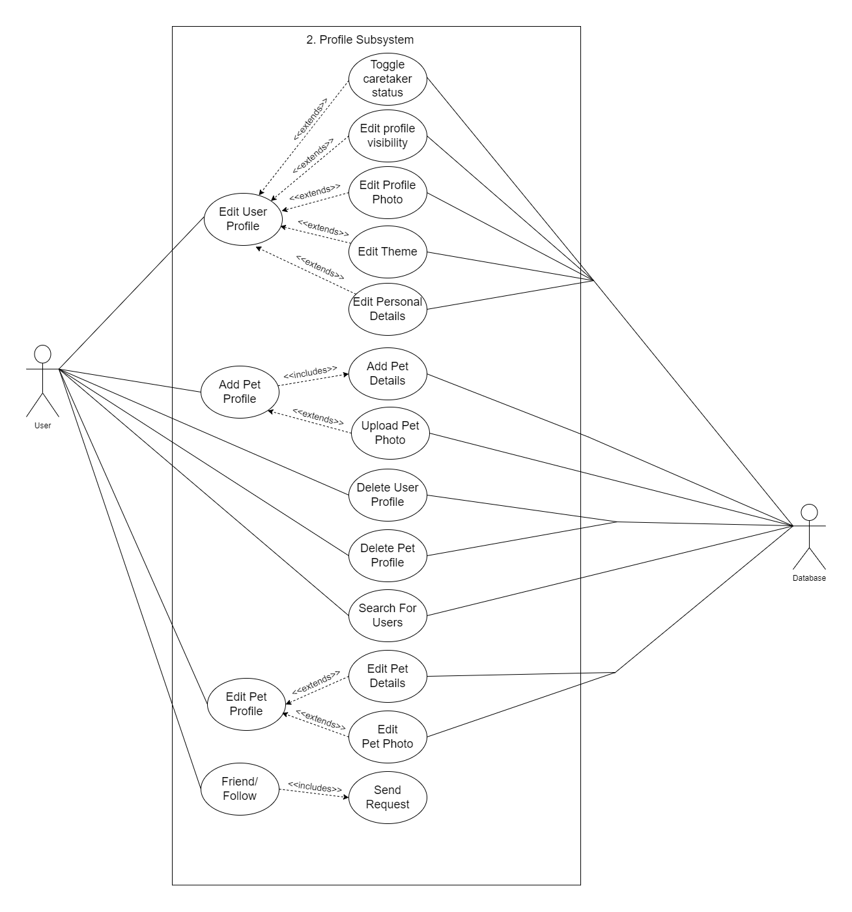
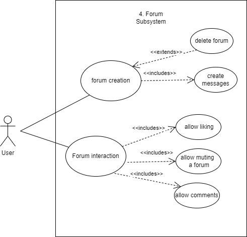
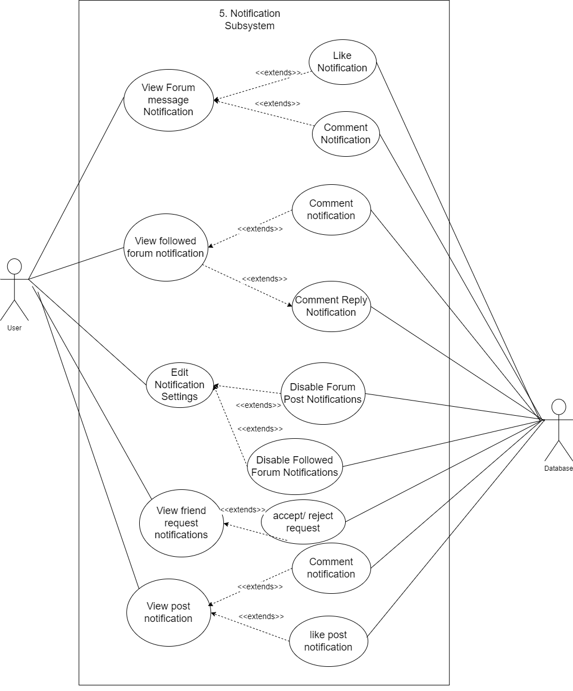

## Introduction
Tailwaggr’s vision is to be a one-stop shop for all things pet, fostering a vibrant and a supportive online community for pet owners and enthusiasts.

Our objectives are to:
* Empower pet owners: Provide a platform that simplifies pet care and strengthens the bond between owners and their furry companions.
* Connect the pet care community: Facilitate connections between pet owners, veterinarians, pet sitters, and other animal lovers through forums and relevant services.
*  Enhance pet well-being: Offer resources and tools that promote responsible pet ownership and contribute to the overall health and happiness of  pets.

## Business Need
The pet care industry is booming, with a growing number of people considering pets as valued members of their families. Tailwaggr addresses this need by:
* Centralizing pet care resources: Simplifying the process of finding qualified pet care professionals and relevant pet information.
* Enhancing convenience: Offering a mobile app allows pet owners to manage their pet’s needs and access services on the go.
* Building a community: Providing a platform for pet owners to connect, share experiences, and offer support to each other.

## Project Scope
The initial scope of Tailwaggr focuses on core functionalities:
* Pet profiles and owner profiles: Create detailed profiles for pets and their owners, fostering a sense of community and personalization.
* Find a veterinarian: Allow pet owners to locate and connect with licensed veterinarians in their area.
* Find a pet sitter: Enable pet owners to discover reliable pet sitters and dog walkers for in-home or scheduled pet care.
* Pet forums: Establish a dedicated forum section where pet owners can ask questions, share experiences, and build relationships.
* Lost & Found Pets: Create a database to reunite lost pets with their worried owners and facilitate faster reunions.

## Class diagram

## User stories/user characteristics:
User Characteristics:

Normal User:
* Loves their pet
* Looks after their pet
* Makes posts
 
Pet Caretaker User:
* Has regular user characteristics
* Has contact details listed
* Has location listed

## User Stories for TailWagger

### User Accounts Subsystem
1. As a new user, I want to sign up for an account so that I can access the application's features.
2. As a user, I want to enter my username during sign-up so that I can create a unique identity.
3. As a user, I want to enter my password during sign-up so that my account is secure.
4. As a user, I want to enter my email address during sign-up so that I can receive notifications and account-related information.
5. As a user, I want to fill in my personal details during sign-up so that my profile is complete.
6. As a returning user, I want to log in to my account so that I can access my profile and pets' information.
7. As a returning user, I want to reset my password if I forget it so that I can regain access to my account.
8. As a user, I want to log in with my email and password so that I can access my account securely.

### Profile Subsystem
1. As a user, I want to edit my profile photo so that I can personalise my account.
2. As a user, I want to edit my username so that I can update my display name.
3. As a user, I want to edit my personal details so that my profile information is up-to-date.
4. As a user, I want to add a pet profile so that I can keep track of my pets' information.
5. As a user, I want to add my pet's details so that the profile is complete.
6. As a user, I want to delete my profile so that I can remove my account from the system.
7. As a user, I want to be prompted to confirm profile deletion so that I don't accidentally delete my profile.
8. As a user, I want my profile to be deleted from the database so that my information is removed.
9. As a user, I want to delete a pet profile so that I can remove pets that I no longer own.
10. As a user, I want to be prompted to confirm pet profile deletion so that I don't accidentally delete it.
11. As a user, I want my pet profile to be deleted from the database so that the information is removed.
12. As a user, I want to edit my pet's details so that the profile information is up-to-date.
13. As a user, I want to edit my pet's profile photo so that it is personalised.
14. As a pet caretaker, I want to be able to label my profile appropriately
15. As a user, I want to be able to search for other users

### Location Subsystem
1. As a user, I want to search for found pets so that I can find my lost pet.
2. As a user, I want to enter a pet name during the search so that I can find specific lost pets.
3. As a user, I want to view search results so that I can see the found pets' information.
4. As a user, I want to find veterinarians around my area so that I can get medical care for my pet.
5. As a user, I want to see the location of the vet clinic so that I can visit it.
6. As a user, I want to see the vet's details so that I can contact them for an appointment.
7. As a user, I want to find pet caretaker details so that I can find someone to take care of my pet.
8. As a user, I want to register my pet as a lost pet so that people can help locate it.
9. As a user, I want to record my sightings of lost pets.

### Content Subsystem
1. As a user, I  want to create forums so that I can initiate discussions on relevant topics about pets.
2. As a user, I want to like a forum post so that I can show my appreciation for the content.
3. As a user, I want to comment on a forum post so that I can participate in the discussion.
4. As a user, I want to reply to messages within a forum post to have discussion with others.
5. As a user, I want to be able to like messages within a forum to show appreciation for them.
6. As a user, I want to be able to delete unwanted forums.
7. As a user, I want to be able to create and delete my posts
8. As a user, I want to be able to like and comment on other user's posts

### Notifications Subsystem
1. As a user, I want to receive notifications for new comments and likes on my posts so that I can stay updated.
2. As a user, I want to receive notifications for new likes on my forum messages and repplies to them so that I know when others appreciate my content.
3. As a user, I want to receive notifications about requests to follow me.

## Functional requirements
1. User Accounts subsystem:
    1.  User must be able to Sign up:
        1. Enter their name
        2. User must be able to enter their valid password
        3. User must be able to enter their valid email address
    2.  User must be able to login:
        1. User must be able to reset their password
        2. User must be able to login with email
        3. User must be able to login with their password
2. Profile subsystem:
    1.  User must be able to edit their profile:
        1. User must be able to edit their profile photo
        2. User must be able to edit their personal details
    2.  User must be able to add a pet profile:
        1. User must be able to add pet details
        2. User must be able to upload pet profile photo
    3.  User must be able to delete their profile:
        1. User must be prompted to confirm profile deletion
        2. User should be deleted from the database
    4.  User must be able to delete a pet profile
        1. User must be prompted to confirm profile deletion
        2. Pet should be deleted from the database
    5.  User must be able to edit a pet profile:
        1. User must be able to edit pet details
        2. User must be able to edit pet gallery
    6. User must be able to become Pet Caretaker
		1. Caretaker must be able to provide contact details
    7. User must be able to search for other users
        1. User must be able to enter other user's name
        2. User must be able to view matching user search results
    8. User must be able to change profile between public and private
    9. User must be able to follow and be followed by other users    
3. Location subsystem:
    1.  User must be able to search for found pets:
        1. User must be able to enter a pet name
        2. The user must be able to view search results
    2.  User must to able to find Veterinarians around their area:
        1. Users must be able to see the location of the vet clinic
        2. Users must be able to see the vet details
    3.  Users must be able to find a pet caretaker:
        1. Users must be see pet caretaker details
        2. User must be able to see the pet caretaker location
4. Content subsystem:
    1.  Users must be able to create forum
        1. Users must be able to create forums
        2. Users must be able to create forum posts
        3. Users must be able to delete their forums
        4. Users must be able to delete their messages
    2.  Users must be able to interact with posts
        1. Users must be able to like a post
        2. Users must be able to share a post
        3. Users must be able to comment on a post
        4. Users must be able to delete their posts
5. Notifications subsystem:
    1. Users must be able to receive notifications from their posts
        1. Users must receive notifications if they receive a like on their posts
        2. User must receive notifications if they receive a comment on their posts  	
    3. Users must be able to receive notifications from their forums
        1. Users must be able to receive notifications about new messages on forums they have created
        2. Users must be able to receive notifications for replies on their messages on forums

## Use Case diagrams:

## Quality Attributes and Architecture Strategies

1. **Performance:**
   - Optimize Firebase queries to ensure efficient data retrieval and usage throughout the application.
   - Use caching mechanisms in Flutter to minimize unnecessary calls to the backend.
   - Implement lazy loading for images and data to improve app load times.

2. **Scalability:**
   - Use Firebase's scalable infrastructure to handle changes in traffic and usage effectively.
   - Implement Firebase Functions to handle backend logic, allowing the app to scale horizontally.
   - Design the app architecture to support future enhancements and additional features without significant refactoring.

3. **Reliability:**
   - Monitor Firebase backend using Firebase Performance Monitoring to ensure system components are operating within safe parameters.
   - Implement robust error handling and retry mechanisms in Flutter to handle intermittent network issues.
   - Use Firebase Firestore's offline data capabilities to ensure the app remains functional during network disruptions.

4. **Security:**
   - Use Firebase Authentication to manage user sessions securely.
   - Implement Firestore Security Rules to control access to database records.
   - Ensure all data transmitted between the app and backend is encrypted using HTTPS.

5. **Usability:**
   - Design the user interface in Flutter to follow intuitive navigation patterns.
   - Provide customization options for users to adjust the interface to their preferences.
   - Ensure the app is accessible, adhering to WCAG (Web Content Accessibility Guidelines) standards.

6. **Availability:**
   - Utilize Firebase's global infrastructure to ensure high availability and low latency.
   - Implement asynchronous operations in Flutter to maintain a responsive user experience.
   - Use Cloud Firestore's offline capabilities to allow users to continue working during network outages.

7. **Maintainability:**
   - Adhere to a modular architecture in Flutter, separating UI, business logic, and data layers.
   - Use a linter and formatter to enforce coding standards and consistency.
   - Write unit and integration tests for Flutter components and Firebase Functions to ensure reliability and ease of maintenance.

8. **Extensibility:**
   - Use Flutter's plugin system to integrate new features and services seamlessly.
   - Structure Firebase Firestore schema to allow easy addition of new data fields and relationships.
   - Design backend services in a modular fashion to accommodate future enhancements with minimal changes.

9. **Cost-effectiveness:**
   - Utilize Firebase's pay-as-you-go model to manage costs effectively, scaling expenses with usage.
   - Optimize cloud function deployments to minimize execution time and reduce costs.
   - Use shared components and services in Flutter to reduce development and maintenance costs.

## Projected Burndown Chart

